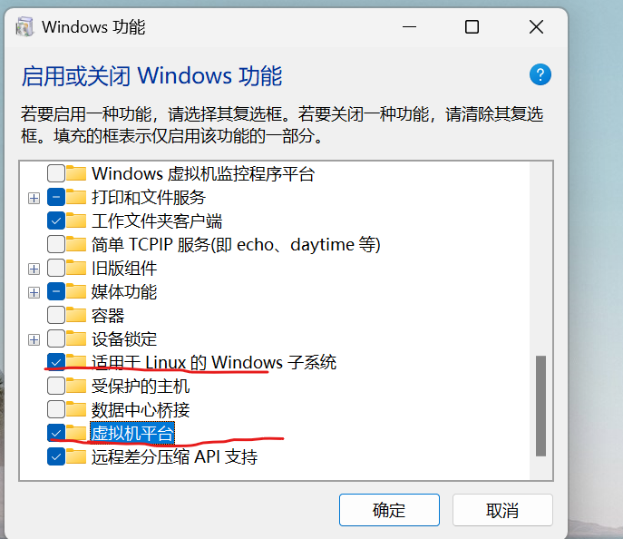
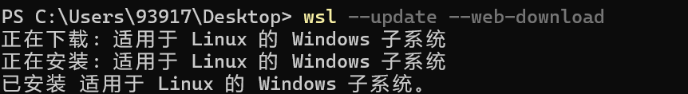
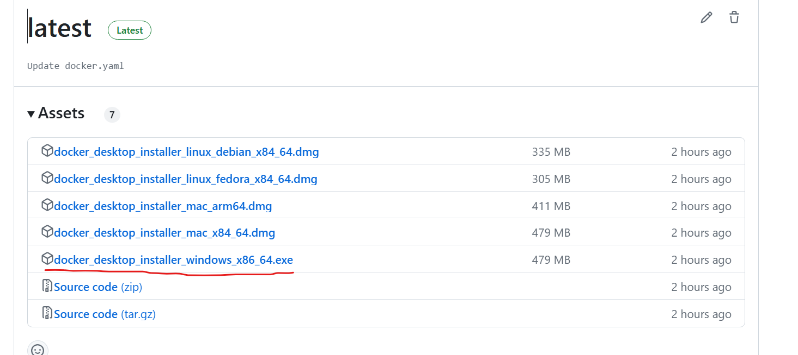
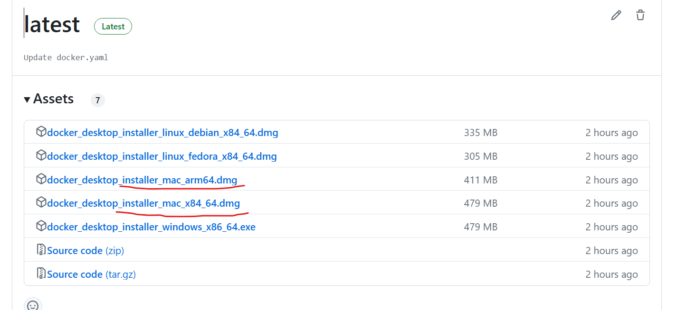
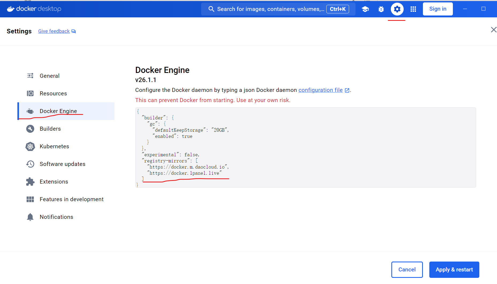

# Docker官方安装包

6月以来，大量Docker镜像网站停服，Docker无法下载安装<br>
本仓库致力于解决国内网络原因无法使用Docker的问题。<br>

### 特点：
- 使用Github Action将官网的安装脚本/安装包定时下载到本项目Release，供国内使用<br>
- 官方安装包，安全可靠<br>
- 每天定时同步，保证最新<br>

作者：**[技术爬爬虾](https://github.com/tech-shrimp/me)**<br>
B站，抖音，Youtube全网同名，转载请注明作者<br>

# 1. Docker安装
## 1.1 Linux
一键安装命令
```
sudo curl -fsSL https://github.com/tech-shrimp/docker_installer/releases/download/latest/linux.sh| bash -s docker --mirror Aliyun
```

> 备用（如果Github访问不了，可以使用Gitee的链接）<br>
```
sudo curl -fsSL https://gitee.com/tech-shrimp/docker_installer/releases/download/latest/linux.sh| bash -s docker --mirror Aliyun
```

启动docker
```
sudo service docker start
```

## 1.2 Windows
任务栏搜索功能，启用"适用于Linux的Windows子系统" + "虚拟机平台" <br>


管理员权限打开命令提示符，安装wsl2<br>
```
wsl --set-default-version 2
wsl --update --web-download
```
等待wsl安装成功

下载Windows版本安装包，进入此项目的Release<br>
https://github.com/tech-shrimp/docker_installer/releases

下载Windows版本安装包

双击安装即可

>可选:
如果想自己指定安装目录，可以使用命令行的方式
参数 --installation-dir=D:\Docker可以指定安装位置


```
start /w "" "Docker Desktop Installer.exe" install --installation-dir=D:\Docker
```

## 1.3 Mac
进入此项目的Release，下载Mac系统的安装包<br>
https://github.com/tech-shrimp/docker_installer/releases

注意区分CPU架构类型 Intel芯片选择x86_64, 苹果芯片选择arm64<br>
下载好双击安装即可

# 2. Pull镜像

### 方案一  转存到阿里云
使用Github Action将国外的Docker镜像转存到阿里云私有仓库，供国内服务器使用，免费易用

- 支持DockerHub, gcr.io, k8s.io, ghcr.io等任意仓库
- 支持最大40GB的大型镜像
- 使用阿里云的官方线路，速度快

项目地址: 
https://github.com/tech-shrimp/docker_image_pusher

### 方案二 镜像站
现在只有很少的国内镜像站存活<br>
不保证镜像齐全,且用且珍惜<br>


#### Linux配置镜像站
```
sudo vi /etc/docker/daemon.json
```
输入下列内容，最后按ESC，输入 :wq! 保存退出。
```
{
    "registry-mirrors": [
        "https://docker.m.daocloud.io",
        "https://docker.1panel.live"
    ]
}
```
重启docker
```
sudo service docker restart
```

### Windows/Mac配置镜像站
Setting->Docker Engine->添加上换源的那一段，如下图


### 方案三 离线镜像
使用Github Action下载docker离线镜像
https://github.com/wukongdaily/DockerTarBuilder

### 方案四 使用一键脚本
bash -c "$(curl -sSLf https://xy.ggbond.org/xy/docker_pull.sh)" -s 完整镜像名

### 方案五 使用Cloudflare worker 自建镜像加速
https://github.com/cmliu/CF-Workers-docker.io

# 3. 去哪里找镜像

https://docker.fxxk.dedyn.io/